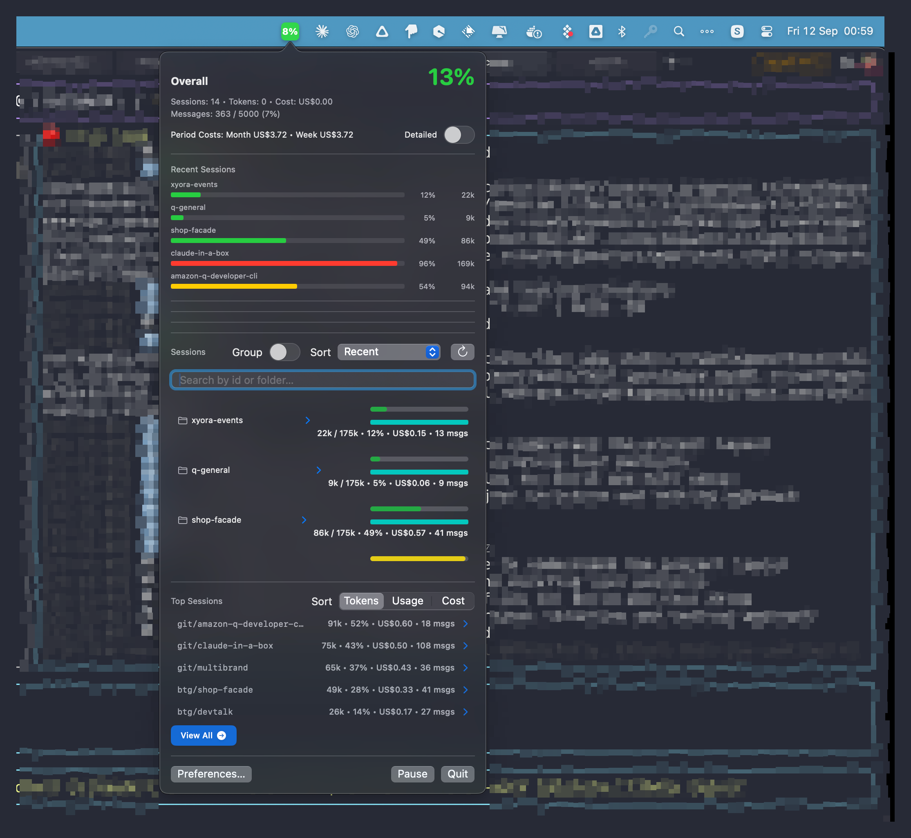
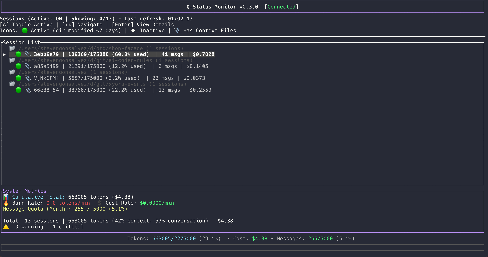

# QStatus Monitor 🚀

Real-time monitoring for your Amazon Q Developer usage with native macOS menubar app and CLI dashboard.

<p align="center">
  
  
</p>

## ✨ Features

### 📊 Real-time Monitoring
- **Token Usage**: Track context window consumption across all sessions
- **Cost Tracking**: Monitor spending by day, week, and month
- **Burn Rate**: See your token consumption rate in real-time
- **Message Quota**: Track your monthly message allowance (363/5000 shown above)

### 🎯 Dual Interface
- **macOS Menubar App**: Always-visible usage indicator with detailed dropdown
- **CLI Dashboard**: Full-featured terminal UI for power users

### 🔥 Smart Analytics
- **Session Tracking**: Individual conversation monitoring with folder organization
- **Visual Indicators**: Color-coded usage bars (green/yellow/red)
- **Top Sessions**: Sort by tokens, usage percentage, or cost
- **Group by Folder**: Organize sessions by project directory

## 📦 Installation

### Homebrew (Coming Soon)

```bash
# Add the tap
brew tap stevengonsalvez/qstatus

# Install CLI tool
brew install qstatus-cli

# Install Menubar app
brew install --cask qstatus-menu
```

### Quick Install Script

```bash
# Download and run the installer
curl -sSL https://github.com/stevengonsalvez/qstatus/releases/latest/download/install.sh | bash
```

### Install from Release

1. Download the latest release from [Releases](https://github.com/stevengonsalvez/qstatus/releases)
2. Open `QStatus.dmg`
3. Drag **QStatus** to your Applications folder
4. Launch from Applications or Spotlight

### Build from Source

```bash
# Clone the repository
git clone https://github.com/stevengonsalvez/qstatus.git
cd qstatus

# Install both apps (from qstatus-menu directory)
cd qstatus-menu && make install

# Or install individually
make install-cli      # CLI only
make install-menubar  # Menubar app only
```

## 🖥️ Usage

### Menubar App


1. Launch **QStatus** from Applications
2. Click the menubar icon to see:
   - **Overall stats**: Sessions, tokens, costs
   - **Recent sessions**: Visual progress bars
   - **Top sessions**: Sortable by different metrics
   - **Preferences**: Customize settings

**Features:**
- 🟢 Green = Safe usage (<50%)
- 🟡 Yellow = Warning (50-90%)
- 🔴 Red = Critical (>90%)
- Click any session for detailed breakdown
- Search sessions by ID or folder
- Group toggle for folder-based view

### CLI Dashboard


```bash
# Run the dashboard
qstatus-cli -i

# Quick status check
qstatus-cli

# JSON output for scripts
qstatus-cli --json
```

**Features:**
- Real-time updates every 2 seconds
- Session list with usage indicators
- System metrics and burn rate
- Message quota tracking
- Color-coded warnings

## ⚙️ Configuration

### Menubar Preferences
- **Context Window**: Default 175,000 tokens (configurable)
- **Token Pricing**: Default $0.0066/1K tokens (configurable)  
- **Refresh Rate**: Update interval in seconds
- **Compact Mode**: Toggle detailed view elements

### Database Location
Both apps read from Amazon Q's SQLite database:
```
~/Library/Application Support/amazon-q/data.sqlite3
```

## 🛠️ Development

### Requirements
- macOS 11.0+
- Rust (for CLI)
- Swift 5.5+ (for menubar app)
- Xcode Command Line Tools

### Project Structure
```
qstatus/
├── qstatus-cli/        # Rust CLI application
│   ├── src/
│   └── Cargo.toml
├── qstatus-menu/    # Swift menubar application
│   ├── Sources/
│   ├── Package.swift
│   └── Makefile
├── docs/
│   └── screenshots/     # Application screenshots
└── README.md
```

### Building

```bash
# From qstatus-menu directory
cd qstatus-menu

# Build everything
make all

# Create release packages
make release

# Clean build artifacts
make clean
```

## 📝 License

MIT License - see [LICENSE](LICENSE) file for details.

## 🤝 Contributing

Contributions are welcome! Please feel free to submit a Pull Request.

1. Fork the repository
2. Create your feature branch (`git checkout -b feature/AmazingFeature`)
3. Commit your changes (`git commit -m 'Add some AmazingFeature'`)
4. Push to the branch (`git push origin feature/AmazingFeature`)
5. Open a Pull Request

## 🐛 Known Issues

- Menubar app requires accessibility permissions on first launch
- CLI requires `/usr/local/bin` in PATH
- Database path may vary based on Amazon Q installation method

## 📊 Screenshots

### Menubar Dropdown View


*Real-time monitoring with visual indicators, sortable sessions, and quota tracking*

### CLI Dashboard


*Terminal UI with session list, metrics, and burn rate tracking*

## 🙏 Acknowledgments

- Built for the Amazon Q Developer community
- Inspired by the need for better usage visibility
- Thanks to all contributors and testers

## 📮 Support

For issues, questions, or suggestions:
- [Open an issue](https://github.com/stevengonsalvez/qstatus/issues)
- [Discussions](https://github.com/stevengonsalvez/qstatus/discussions)

---

<p align="center">
  Made with ❤️ for developers using Amazon Q Developer
</p>

<p align="center">
  <a href="https://github.com/stevengonsalvez/qstatus/releases">
    
  </a>
  <a href="https://github.com/stevengonsalvez/qstatus/blob/main/LICENSE">
    
  </a>
  <a href="https://github.com/stevengonsalvez/qstatus/stargazers">
    
  </a>
</p>